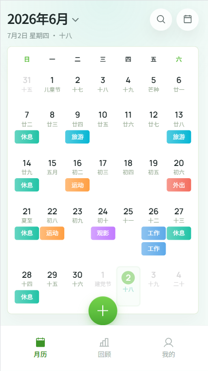
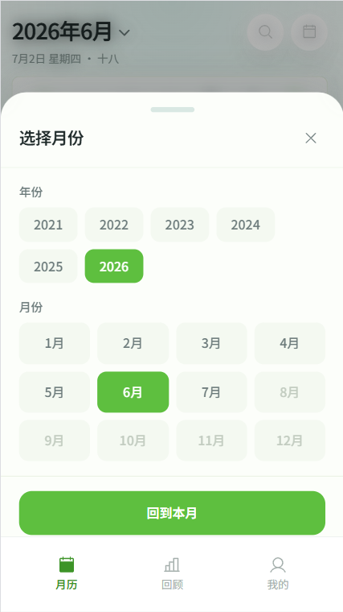
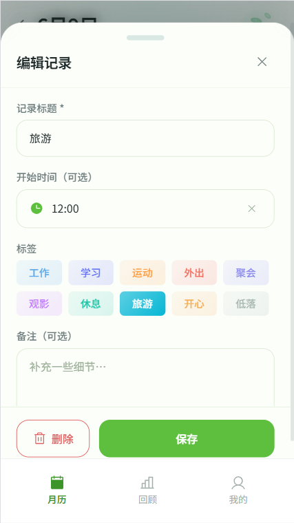
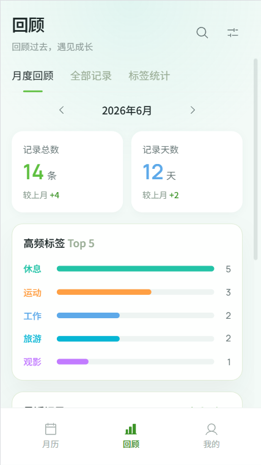
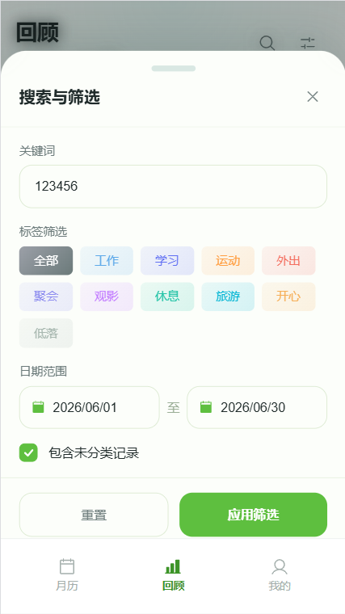
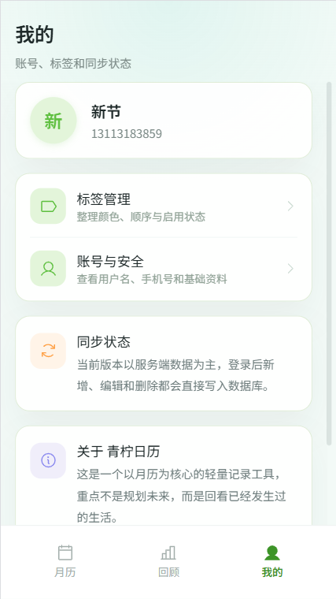

# Lime Calendar | 青柠日历

一个以月历为核心的轻量生活记录工具。重点不是规划未来，而是回看已经发生过的生活。

## 技术栈

- **Next.js 16** (App Router)
- **React 19** / **TypeScript**
- **Prisma** + **SQLite**（可平滑迁移至 PostgreSQL）
- **Zustand** / **dayjs** / **lunar-typescript**
- **Tailwind CSS 4** + **SCSS**
- **Phosphor Icons** / **Radix UI**

## 界面预览

| 页面 | 截图 |
|------|------|
| 登录 |  |
| 日历页面 |  |
| 选择月份 |  |
| 记录 |  |
| 编辑记录 |  |
| 回顾 |  |
| 筛选与回顾 |  |
| 我的 |  |

## 快速开始

```bash
# 安装依赖
npm install

# 初始化数据库
npm run db:push
npm run db:seed

# 开发模式启动（端口 3400）
npm run dev

# 生产模式启动（夸克/Chrome 均可，无 HMR 干扰）
npm run start
```

启动后访问 `http://localhost:3400`。

### 为什么提供生产模式启动？

夸克浏览器对 WebSocket（HMR）连接不稳定，Next.js 开发模式的 HMR 客户端会不断断连重连导致页面刷新循环。在夸克中调试时请使用 `npm run start` 以生产模式运行。详情见 [docs/debug-quark-hmr-refresh-loop.md](docs/debug-quark-hmr-refresh-loop.md)。

## 可用脚本

| 命令 | 说明 |
|------|------|
| `npm run dev` | Next.js 开发模式（HMR 热更新，端口 3400） |
| `npm run start` | 构建并启动生产服务器（端口 3400，夸克可用） |
| `npm run build` | 仅构建生产产物 |
| `npm run lint` | ESLint 检查 |
| `npm run db:push` | 同步 Prisma schema 到 SQLite |
| `npm run db:seed` | 填充种子数据（含演示账号） |
| `npm run db:generate` | 生成 Prisma Client |

## 演示账号

| 手机号 | 用户名 | 说明 |
|--------|--------|------|
| `13113183859` | 小柠 | 种子数据默认账号 |

## 项目结构

```
src/
├── app/          # Next.js App Router 页面与 API
│   ├── (main)/   # 底部导航主路由组（日历/回顾/我的）
│   ├── login/    # 登录页
│   ├── account/  # 账号与安全
│   ├── tags/     # 标签管理
│   └── api/      # Route Handlers
├── components/
│   ├── commons/  # 公共组件
│   └── business/ # 业务组件
├── features/     # 业务逻辑（按域拆分）
├── stores/       # Zustand 状态管理
├── services/     # 客户端请求封装
├── server/       # 服务端业务逻辑、鉴权
├── lib/          # 工具函数、日期、常量
├── types/        # TypeScript 类型定义
└── styles/       # 全局样式、SCSS 资源
prisma/
├── schema.prisma # 数据模型定义
└── seed.ts       # 种子数据脚本
```

## 视觉方向

清透 · 克制 · 呼吸感 · 轻运动 · 留白 · 不焦虑

主色 `#5EBF3F` — 页面背景 `#E3F5DA` — 卡片 `#FFFFFF`

## 开发规范

详见 [AGENTS.md](AGENTS.md) 与 [Web移动端-PRD.md](Web移动端-PRD.md)。
