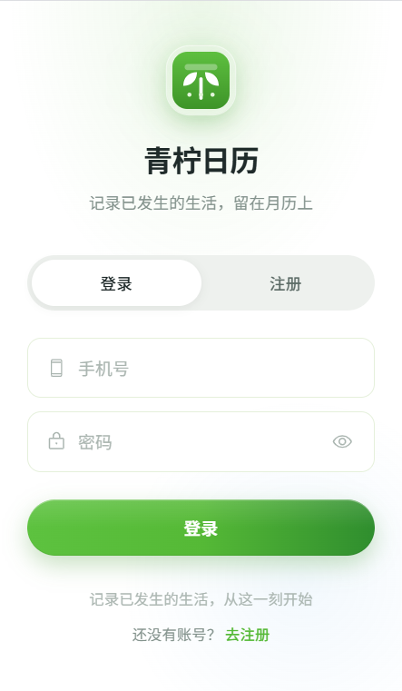
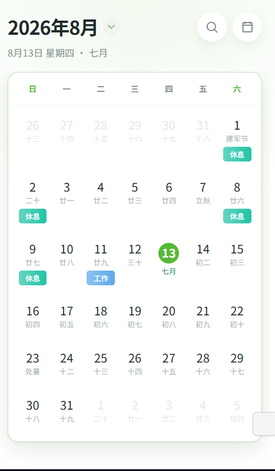
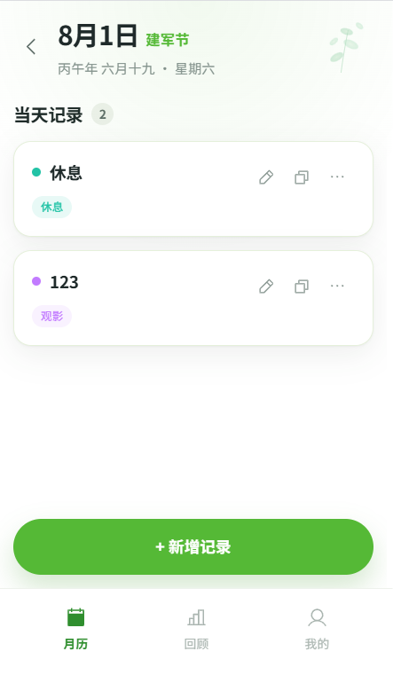
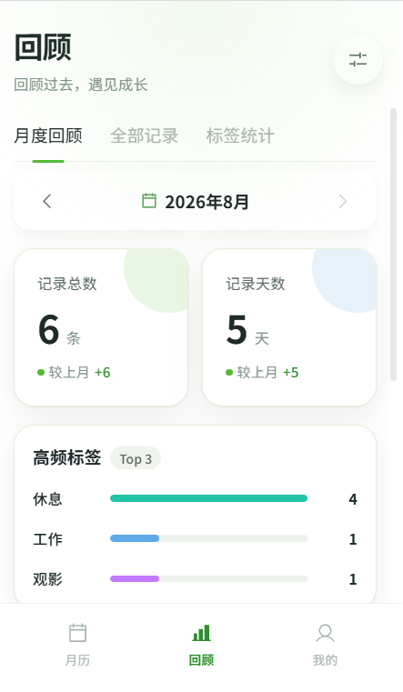
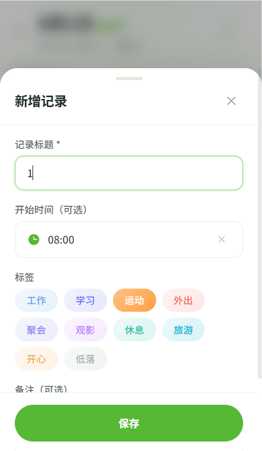
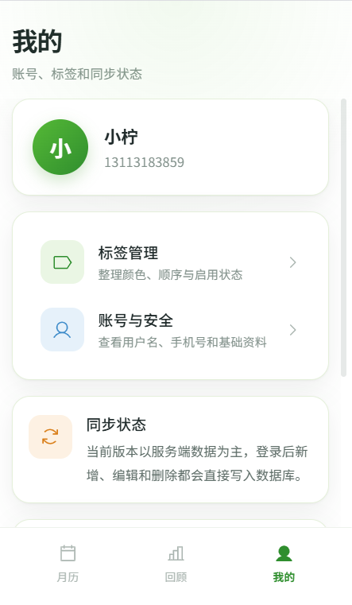

# Lime Calendar | 青柠日历

一个以月历为核心的轻量生活记录工具。重点不是规划未来，而是回看已经发生过的生活。

## 核心功能

- **月历浏览** — 按月展示，日期格显示公历、农历/节气、记录摘要
- **快速记录** — 10 秒内完成一条当天记录，支持标题、标签、时间、备注
- **记录管理** — 新增、编辑、删除，支持记录到过去日期，同一天可多条
- **标签管理** — 自定义标签（名称、颜色、图标、排序）
- **历史搜索** — 按关键词、标签、日期范围筛选
- **月度回顾** — 统计记录总数、记录天数、高频标签 Top N、最近摘要
- **登录同步** — 手机号登录，服务端为主，IndexedDB 仅做缓存

## 技术栈

Nuxt 3 · Vue 3 · TypeScript · Prisma + SQLite · Zustand · dayjs · lunar-typescript · Tailwind CSS 4 · Phosphor Icons

## 界面预览

<div align="center">
  
  
  
</div>

<div align="center">
  
  
  
</div>

<div align="center">
  1. 登录 &nbsp;&nbsp; 2. 日历页面 &nbsp;&nbsp; 3. 选择月份 &nbsp;&nbsp; 4. 记录 &nbsp;&nbsp; 5. 编辑记录 &nbsp;&nbsp; 6. 回顾
</div>

## 快速开始

```bash
npm install          # 安装依赖
npm run db:push      # 初始化数据库
npm run db:seed      # 填充种子数据
npm run dev          # 开发模式启动（端口 3400）
npm run start        # 生产模式启动（夸克/Chrome 可用）
```

启动后访问 `http://localhost:3400`。

> Node.js 需 **22.x** 及以上（`@nuxt/eslint` 依赖 `Object.groupBy`）。建议用 `.nvmrc`（内容 `22`）配合 fnm/nvm 管理版本。

### 环境变量

复制 `.env.example` 为 `.env`：

| 变量 | 说明 | 默认值 |
|------|------|--------|
| `DATABASE_URL` | 数据库连接字符串 | `file:./dev.db` |

> 生产环境请改为绝对路径，如 `file:/var/www/flow-calendar/data/prod.db`。

## 数据库

使用 **Prisma + SQLite**，可平滑迁移至 PostgreSQL（修改 `.env` 的 `DATABASE_URL` 即可）。

```bash
npm run db:push          # 同步表结构
npm run db:seed          # 填充种子数据（含演示账号）
npx prisma studio        # 可视化查看数据
```

核心表：`users` · `calendars` · `event_tags` · `schedule_events` · `repeat_rules` · `daily_checkins` · `template_plans`（详见 [prisma/schema.prisma](prisma/schema.prisma)）。

## 部署

通过 GitHub Actions 自动部署到阿里云 ECS，架构：`Nginx → PM2 → Nuxt 3 (Nitro node-server) + SQLite`。

```bash
npm run build                                            # 构建产物（.output/）
rsync -avz --delete .output/ user@ecs:/var/www/flow-calendar/app/
pm2 reload ecosystem.config.js                           # 重启服务
```

> 详细部署与问题排查见 [docs/部署文档与问题排查.md](docs/部署文档与问题排查.md)。

## 可用脚本

| 命令 | 说明 |
|------|------|
| `npm run dev` | 开发模式（HMR，端口 3400） |
| `npm run start` | 构建并启动生产服务器 |
| `npm run build` | 仅构建生产产物 |
| `npm run lint` | ESLint 检查 |
| `npm run db:push` / `db:seed` / `db:generate` | 数据库同步 / 种子 / 生成 Client |

## 演示账号

| 手机号 | 用户名 | 说明 |
|--------|--------|------|
| `13113183859` | 小柠 | 种子数据默认账号 |

## 项目结构

```
app/              # Nuxt 3 应用（pages、components、composables、stores、services、utils）
server/           # Nitro 服务端（api、utils）
prisma/           # 数据模型（schema.prisma、seed.ts）
```

## 视觉方向

清透 · 克制 · 呼吸感 · 轻运动 · 留白 · 不焦虑

主色 `#5EBF3F` — 页面背景 `#E3F5DA` — 卡片 `#FFFFFF`

## 开发规范

详见 [AGENTS.md](AGENTS.md) 与 [Web移动端-PRD.md](Web移动端-PRD.md)。
